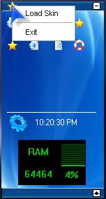

<div align="center">

## xdgDock \(UPDATE\)


</div>

### Description

This is a desktop "Dock" that allows you to create and delete shortcuts to your most used programs, an alternative to having to use the start menu or the Recent Used list upon it actually. This is the first of it's re-vamps, full skinning support coming soon, along with a system resources meter also! 

----

UPDATED! Simple Skinning Support is now in place, along with CPU and RAM usage that is now in a show-and-hide spot (see the new white icon on the bottom of the bar?) I have to give credit to the people that has made code that i am currently borrowin from, that is until i com eup with a more efficient way to do what i need for it to do... The Winux Project, for the RAM and CPU Usage AND the creator of B2 for me to get the system folders (Start Menu, Favorites, Ect...) Still has the delete bug in it (just exit out of it and then re-start it), and when you run it your task bar will go away, but just close the Dock and it will come back, that i sbecause in the next version there WILL be a start menu built in to it. READ THE HOWTO for doing skins, i would very much like to get people to make skins for this thing, you know? (HOWTO is in the Skins/Default folder AND in the root of the zipfile)

----

http://geocities.com/pfcmurphy/xdgDock.zip
 
### More Info
 


<span>             |<span>
---                |---
**Submitted On**   |
**By**             |[xIntegrated Development Group](https://github.com/Planet-Source-Code/PSCIndex/blob/master/ByAuthor/xintegrated-development-group.md)
**Level**          |Intermediate
**User Rating**    |4.0 (16 globes from 4 users)
**Compatibility**  |VB 6\.0
**Category**       |[Miscellaneous](https://github.com/Planet-Source-Code/PSCIndex/blob/master/ByCategory/miscellaneous__1-1.md)
**World**          |[Visual Basic](https://github.com/Planet-Source-Code/PSCIndex/blob/master/ByWorld/visual-basic.md)
**Archive File**   |[](https://github.com/Planet-Source-Code/xintegrated-development-group-xdgdock-update__1-49528/archive/master.zip)


### Source Code

```
'You need to download it from here
http://geocities.com/pfcmurphy/xdgDock.zip
```

